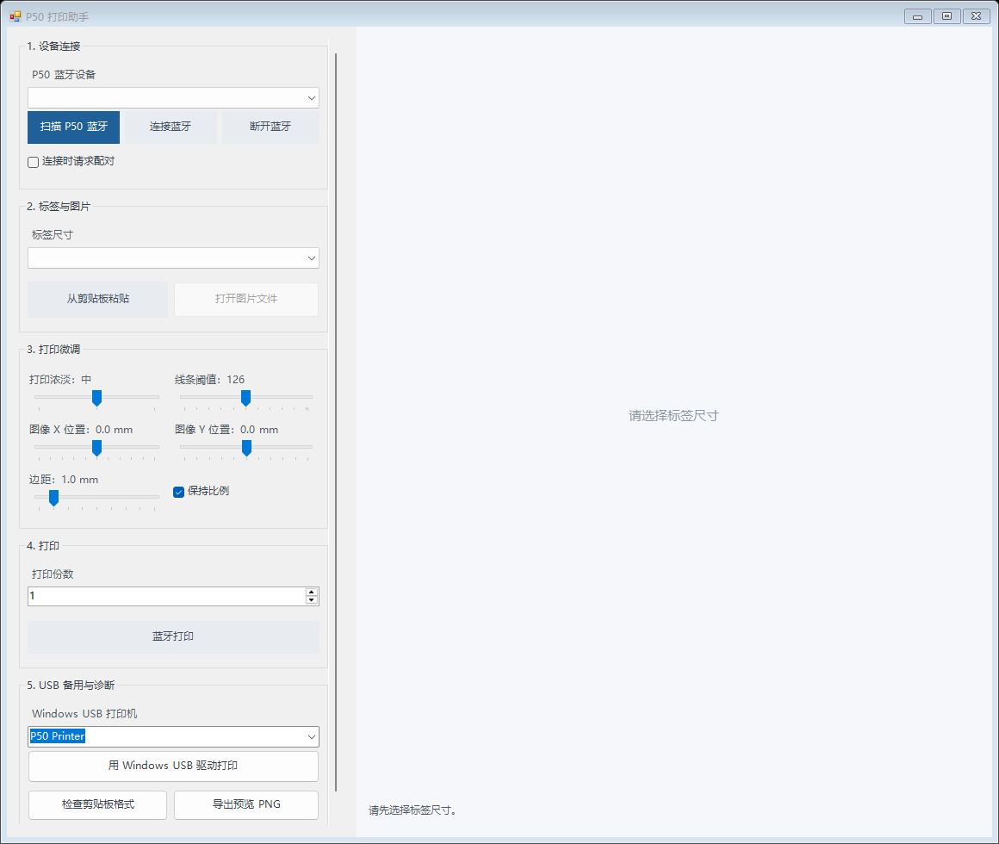

# P50 Print Assistant

Windows 桌面端凝优 P50S 热敏标签打印助手，主打快速蓝牙连接、真实标签尺寸预览和所见即所得打印。

它会按标签实际点阵生成预览，再通过持续蓝牙连接发送到打印机，适合需要在 Windows 上稳定打印小标签的场景。



## 下载

推荐直接使用发布版：

[下载最新 Release](https://github.com/zhenchen360/p50-print-assistant/releases/latest)

下载 zip 后解压，双击：

```text
Start_P50_Print_Assistant.vbs
```

发布版已包含蓝牙运行时，不需要安装 Python。

## 能做什么

- 快速扫描、连接凝优 P50S 热敏标签打印机
- 按真实标签尺寸实时预览打印效果
- 从剪贴板粘贴 EMF 矢量图或位图，适合 ChemDraw 结构式、线稿、图标等内容
- 打开 PNG/JPEG/BMP/GIF/TIFF/EMF/WMF 图片
- 支持 `30 x 15 mm`、`40 x 20 mm`、`40 x 30 mm`
- 按 8 点/mm 渲染预览，匹配约 203 dpi 标签打印
- 调整边距、X/Y 位置、线条阈值、蓝牙浓淡
- 保持蓝牙连接，支持连续打印
- 提供 Windows USB 备用打印入口

## 蓝牙连接与打印

程序采用“扫描、连接、打印、断开”的蓝牙工作流，连接后会复用当前会话，连续打印时等待打印机确认后再发送下一份。

蓝牙协议和打印命令细节见 [Protocol Notes](docs/protocol-notes.md)。

## USB 备用与驱动

使用 USB 备用打印前，需要安装：

- P50S Windows 驱动：[Marklife Printer Driver P50S win](https://www.marklifeprinter.com/download/download-15-802.html)，点击 `DOWNLOAD` 安装。

安装后，在系统打印机列表里选择 `P50 Printer` 之类的打印机名称即可使用 USB 备用打印。

USB 驱动适配细节见 [USB Driver Notes](docs/usb-driver-notes.md)。

## 使用流程

1. 扫描并连接凝优 P50S 蓝牙设备
2. 选择标签尺寸
3. 从剪贴板粘贴，或打开图片文件
4. 调整阈值、蓝牙浓淡、边距和位置
5. 点击蓝牙打印

未选择标签尺寸时，导入图片和蓝牙打印按钮会保持禁用。

## 从源码运行

开发或自行修改时再使用源码运行。

需要：

- Windows 10/11
- Python 3.10+
- 已开启蓝牙

安装依赖：

```powershell
python -m pip install -r requirements.txt
```

运行：

```powershell
powershell -NoProfile -ExecutionPolicy Bypass -STA -File .\P50_Print_Assistant.ps1
```

## 适配范围

当前主要面向凝优 P50S 热敏标签打印机，标签宽度按 8 点/mm 渲染。

欢迎提交更多标签尺寸、固件变体适配和阈值算法改进。

## License

MIT License. See [LICENSE](LICENSE).
